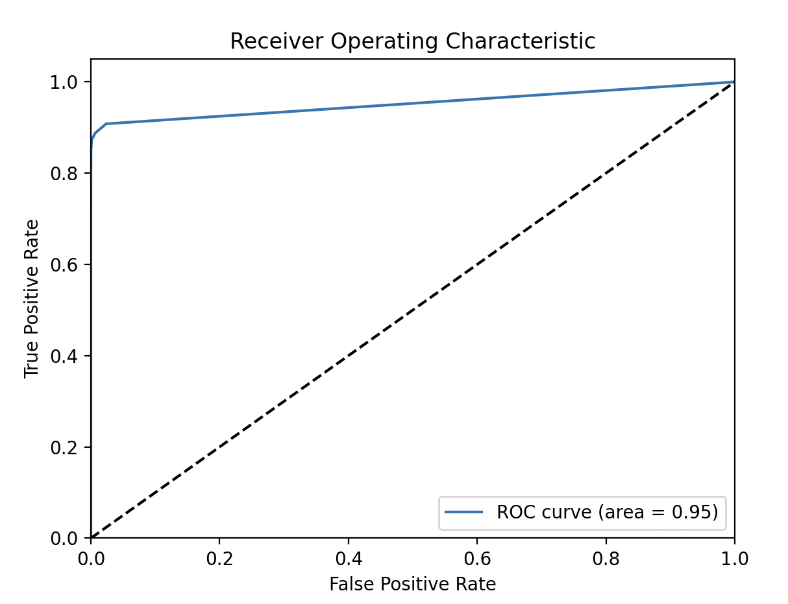

Fraud Detection System

Project Overview
This project involves developing a sophisticated Fraud Detection System to identify fraudulent financial transactions. The system leverages machine learning techniques and is deployed as a web service using Flask, hosted on AWS Elastic Beanstalk.

Features
- Machine Learning Model**: Built a predictive model using scikit-learn to detect fraudulent transactions with high accuracy.
- Data Pipeline**: Designed and implemented a data processing pipeline for data cleaning, feature scaling, and model training.
- API Integration**: Integrated real-time financial data from Alpha Vantage API to keep the model updated with the latest transaction data.
- Web Service Deployment**: Deployed the Flask application on AWS Elastic Beanstalk, ensuring scalability and robustness.

Model Performance

The performance of the fraud detection model is evaluated using the Receiver Operating Characteristic (ROC) curve. The ROC curve illustrates the true positive rate (sensitivity) against the false positive rate for various threshold values.

ROC Curve

The area under the ROC curve (AUC) is 0.95, indicating excellent performance. The model achieves a high true positive rate while maintaining a low false positive rate, effectively distinguishing between fraudulent and non-fraudulent transactions. This high AUC value demonstrates that the model is highly effective at identifying fraudulent transactions.
